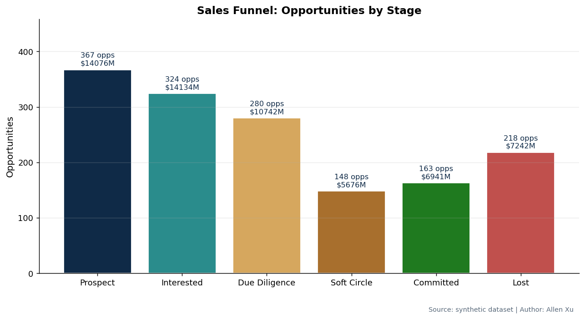
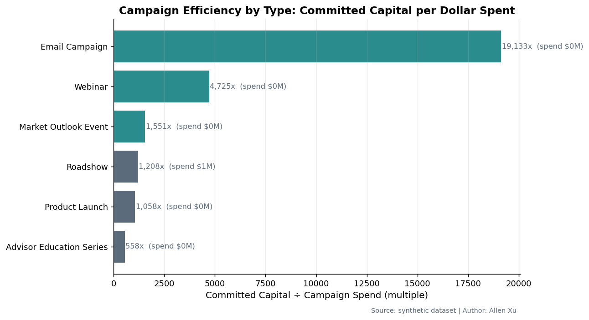

# Alternative Investment Sales Strategy Analytics Platform

**Author:** Allen Xu

End-to-end analytics platform that simulates how a Global Client Solutions / Global Wealth Solutions team at an alternative investment firm uses data to drive sales strategy, advisor coverage, product distribution, and campaign ROI. Built entirely on a synthetic but realistic 12-month dataset (400 advisors, 16 RMs, 10 funds, 28 campaigns, 7,500 sales activities, 1,500 opportunities, ~1,400 campaign-engagement records).

> **Disclosure:** All data is synthetic and generated deterministically from a fixed random seed. No real client, advisor, fund, or firm data is used. The project is portfolio work and not affiliated with any specific firm.

---

## Overview

Alternative investment distribution is a long-cycle, capital-concentrated business. Closing a single commitment can take six months; a small number of advisors and channels generate most of the committed capital; and sales coverage is the single largest distribution cost. This project builds the analytics layer such a business needs:

1. A funnel diagnostic that quantifies stage drop-off, conversion, and pipeline value at the region / firm-type / asset-class / AUM-segment cuts senior leadership cares about.
2. A relationship-manager productivity rollup that flags coaching opportunities — RMs whose engagement is high but conversion is below the team median.
3. A product-demand view that surfaces where activity hours are spent vs. where committed capital is generated.
4. A campaign ROI module that calculates committed-capital-per-dollar-spent, qualified-opportunity costs, and a fee-revenue proxy.
5. An advisor priority score that ranks every advisor on a single 0-1 scale, assigns tiers, and recommends the next best action and asset class.

The deliverables are designed to be portfolio-quality: clean SQL that mirrors the Python, dashboard-ready CSVs, an executive narrative for senior stakeholders, and a deterministic data generator so anyone can reproduce the entire pipeline in a single command.

## Project Highlights

- Built a synthetic 12-month alternative investment distribution dataset with 400 advisors, 16 relationship managers, 10 funds, 7,500 sales activities, 1,500 opportunities, and 28 campaigns.
- Created SQL and Python analytics pipelines for sales funnel conversion, relationship manager productivity, campaign ROI, product demand, and advisor prioritization.
- Produced six dashboard-ready CSV marts, four executive charts, a Tableau / Power BI dashboard wireframe, and an executive report.
- Designed the project to mirror sales strategy analytics use cases in Global Client Solutions / Wealth Solutions.
- Clearly separates synthetic data generation from analytics outputs so the pipeline is reproducible and safe to share publicly.

## Quick Navigation

- [Executive Report](reports/executive_report.md)
- [Methodology and Assumptions](docs/METHODOLOGY_AND_ASSUMPTIONS.md)
- [Data Quality Checks](docs/DATA_QUALITY_CHECKS.md)
- [Interview Notes](docs/INTERVIEW_NOTES.md)
- [Dashboard Wireframe](dashboard/dashboard_wireframe.md)
- [SQL Analysis](sql/)
- [Python Pipeline](src/)

## Why This Project

The role this project simulates — analyst on a sales-strategy team at an alternative investment firm — needs analytics across exactly the dimensions modeled here:

- **Sales strategy / sales enablement:** funnel conversion, product demand, segment-level ROI.
- **Global Client Solutions / Wealth Solutions:** advisor segmentation across RIAs, family offices, private banks, wirehouses, and institutional channels.
- **Alternative investments distribution:** Private Equity, Private Credit, Infrastructure, Real Estate at fund-level granularity.
- **Relationship-manager productivity:** activity, conversion, capital-per-meeting, days-to-close, coaching diagnostics.
- **Senior-stakeholder reporting:** executive KPI table, structured Markdown briefing, Tableau / Power BI-ready summaries.

## Business Questions

The platform was built to answer five questions:

1. **Sales funnel:** Where does the pipeline drop off, and which segments / regions / asset classes convert best?
2. **RM productivity:** Who is closing capital, who is generating activity without conversion, and how do we identify coaching opportunities?
3. **Product demand:** Which asset classes and funds are driving committed capital, and where is RM time mis-allocated?
4. **Campaign ROI:** Which campaigns and channels produce the most attributable committed capital per dollar spent?
5. **Advisor prioritization:** Which advisors should each RM call this week, and what is the recommended next best action?

## Dataset

Seven raw tables under `data/raw/`:

| Table | Rows | Grain |
|---|---:|---|
| `advisors.csv` | 400 | Advisor (firm type, region, AUM segment, alt experience, RM coverage) |
| `relationship_managers.csv` | 16 | RM (region, tenure, coverage segment, sales team) |
| `funds.csv` | 10 | Fund (asset class, strategy, vintage, target return, minimum) |
| `sales_activities.csv` | 7,500 | RM ↔ Advisor activity (type, engagement, follow-up status) |
| `opportunities.csv` | 1,500 | Pipeline opportunity (stage, expected/actual commitment, days to close) |
| `campaigns.csv` | 28 | Marketing program (type, segment, asset class, region, cost) |
| `campaign_engagement.csv` | 1,408 | Campaign ↔ Advisor engagement (open, attend, download, follow-up, meet) |

Six processed marts under `data/processed/` (described in [`data/data_dictionary.md`](data/data_dictionary.md)).

## Methodology

1. **Synthetic data generation** ([`src/generate_synthetic_data.py`](src/generate_synthetic_data.py)). Builds correlated reference data (firm types weight AUM, AUM weights commitment size, engagement weights stage progression). Deterministic under seed `42`.
2. **Data modeling.** All seven tables loaded into a SQLite database ([`src/build_sqlite_database.py`](src/build_sqlite_database.py)) with indexes on the join keys an analyst would actually query.
3. **SQL analysis.** Five portable SQL scripts under [`sql/`](sql/) mirror the Python pipeline (funnel, RM, product, campaign ROI, priority scoring). Each script is commented and runnable against the SQLite DB.
4. **Python analysis.** [`src/run_analysis.py`](src/run_analysis.py) computes the same five analyses with pandas, plus a consolidated executive KPI table.
5. **ROI analysis.** Per-campaign and per-channel ROI using committed-capital-to-cost multiples and a 2.5% management-fee revenue proxy.
6. **RM productivity metrics.** Activity volume, follow-up completion, conversion, pipeline-per-meeting, commitment-per-meeting, and a coaching flag.
7. **Advisor priority scoring.** Five-component weighted score → tier assignment → rule-based next-best-action.
8. **Dashboard-ready outputs.** All processed CSVs are pivot-friendly and shaped for direct ingestion into Tableau or Power BI per [`dashboard/dashboard_data_model.md`](dashboard/dashboard_data_model.md).

## Key Metrics

| Metric | Definition |
|---|---|
| Funnel conversion rate | `committed_count / total_opps` overall and by segment |
| Committed capital | Sum of `actual_commitment` for stage = Committed |
| Expected pipeline | Sum of `expected_commitment` across all stages |
| Campaign ROI % | `(committed_capital × 0.025 − campaign_cost) / campaign_cost` |
| Cost per qualified opportunity | `campaign_cost / opps_at_DD_or_later` |
| Commitment per meeting | `committed_capital / total_activities` |
| Average days to close | Mean `days_to_close` for committed deals |
| Advisor priority score | 0.30 × engagement + 0.25 × AUM + 0.20 × conversion + 0.15 × product fit + 0.10 × recency |

## Project Structure

```
alternative-investment-sales-strategy-analytics/
├── README.md                     ← this file
├── requirements.txt
├── .gitignore
│
├── data/
│   ├── raw/                      ← 7 generated CSVs
│   ├── processed/                ← 6 dashboard-ready CSVs + SQLite DB
│   └── data_dictionary.md
│
├── sql/
│   ├── create_tables.sql
│   ├── 01_sales_funnel_analysis.sql
│   ├── 02_rm_productivity_analysis.sql
│   ├── 03_product_demand_analysis.sql
│   ├── 04_campaign_roi_analysis.sql
│   └── 05_advisor_priority_scoring.sql
│
├── notebooks/
│   └── 01_analysis_workflow.ipynb
│
├── src/
│   ├── generate_synthetic_data.py
│   ├── build_sqlite_database.py
│   ├── run_analysis.py
│   ├── create_charts.py
│   └── validate_outputs.py
│
├── reports/
│   ├── executive_report.md
│   └── charts/                   ← 4 PNGs
│
├── dashboard/
│   ├── tableau_powerbi_notes.md
│   ├── dashboard_data_model.md
│   └── dashboard_wireframe.md
│
└── docs/
    ├── INTERVIEW_NOTES.md
    ├── METHODOLOGY_AND_ASSUMPTIONS.md
    ├── DATA_QUALITY_CHECKS.md
    └── GITHUB_REPO_PRESENTATION.md
```

## How to Run

The pipeline is fully reproducible from a clean checkout:

```bash
python3.11 -m pip install -r requirements.txt

python3.11 src/generate_synthetic_data.py     # Step 1: write 7 raw CSVs
python3.11 src/build_sqlite_database.py       # Step 2: load CSVs into SQLite
python3.11 src/run_analysis.py                # Step 3: compute 6 processed marts
python3.11 src/create_charts.py               # Step 4: render 4 executive PNGs
python3.11 src/validate_outputs.py            # Step 5: validate outputs and QA checks
```

Each step prints row counts so you can verify the pipeline. The SQL files in `sql/` are reference implementations for the Python analyses and can be executed against `data/processed/alternative_investment_sales.db`.

## Sample Insights

These are computed directly from the latest pipeline run (deterministic under seed 42):

- **$58.8B expected pipeline · $6.75B committed capital · 10.87% overall conversion · 150 days average to close.**
- **Family Offices and Institutional Investors generate 59% of committed capital** despite being only 31% of opportunities.
- **Email campaigns produced the highest modeled committed-capital-to-cost multiple** in the synthetic dataset (19,133×), while Roadshows and Product Launches absorb 73% of marketing spend and produce 1,058-1,208× multiples.
- **Three of 16 RMs are coaching opportunities** — above-median engagement (66-68 vs. team median 62.9) but conversion of 6.5-9.2% (vs. team median 10.5%). The diagnosis is follow-up completion (46-48% vs. firm best of 50%+), not access.
- **132 of 400 advisors are high-priority**, with combined estimated commitment opportunity of **$9.65B** for next-quarter coverage planning.
- **Northeast under-converts** — 432 opportunities (the largest book) convert at 8.6%, vs. 14.9% in Midwest and 14.7% in Southwest.

Because the dataset is synthetic, ROI magnitudes should be interpreted directionally. The analytical framework is the main deliverable.

See [`reports/executive_report.md`](reports/executive_report.md) for the full narrative with seven strategic recommendations.

## Selected Visuals





## Dashboard Design

Four pages, designed for senior stakeholders and operational sales teams. Full wireframes in [`dashboard/dashboard_wireframe.md`](dashboard/dashboard_wireframe.md).

1. **Executive Overview** — KPI tiles, funnel by stage, region map, asset-class committed capital, coaching-flagged RMs.
2. **Sales Funnel & Product Demand** — funnel chart, region conversion, asset-class engagement vs capital, fund-level table.
3. **Relationship Manager Productivity** — RM leaderboard, conversion-by-RM, commitment-per-meeting, days-to-close, coaching matrix (engagement × conversion scatter).
4. **Campaign ROI & Advisor Prioritization** — ROI multiple by campaign type, top campaigns, priority advisor table, next-action breakdown.

## Skills Demonstrated

- Sales strategy analytics for an alternative investment distribution business
- Business analytics across 5 distinct analytical dimensions (funnel, RM productivity, product demand, campaign ROI, advisor prioritization)
- Financial modeling: weighted scoring, fee-revenue proxies, ROI multiples
- SQL: window-style aggregation, CTEs, conditional rollups (SQLite)
- Python: synthetic data generation, pandas analytics, matplotlib reporting
- Tableau / Power BI-ready data modeling: star schema, calculated fields, page layout
- ROI analysis: cost-per-qualified-opportunity, committed-capital multiples, channel efficiency benchmarking
- Executive communication: structured Markdown briefing for senior leadership
- Data engineering: SQLite database build, deterministic generation, indexed joins

## Supporting Documentation

- [Methodology and Assumptions](docs/METHODOLOGY_AND_ASSUMPTIONS.md) explains the synthetic data design, scoring logic, ROI interpretation, limitations, and production extensions.
- [Data Quality Checks](docs/DATA_QUALITY_CHECKS.md) summarizes the deterministic output checks and validation coverage.
- [Interview Notes](docs/INTERVIEW_NOTES.md) helps Allen explain the project clearly in behavioral and technical interviews.
- [GitHub Repository Presentation](docs/GITHUB_REPO_PRESENTATION.md) outlines how recruiters and technical reviewers can navigate the repository.

## Future Improvements

- Predictive opportunity scoring (logistic regression / gradient boosting on closed/lost outcomes) to replace the static `conv_prob_norm` component.
- CRM integration (Salesforce / HubSpot) for live activity and opportunity ingestion.
- Fee-stream model: fund-level management and performance fee schedules over fund life, instead of a 2.5% proxy.
- Live dashboard deployment (Tableau Server, Power BI Service) with row-level security on `rm_id`.
- Advanced advisor segmentation (clustering on activity / commitment patterns).
- Time-series analysis of pipeline aging and stage-progression velocity.
